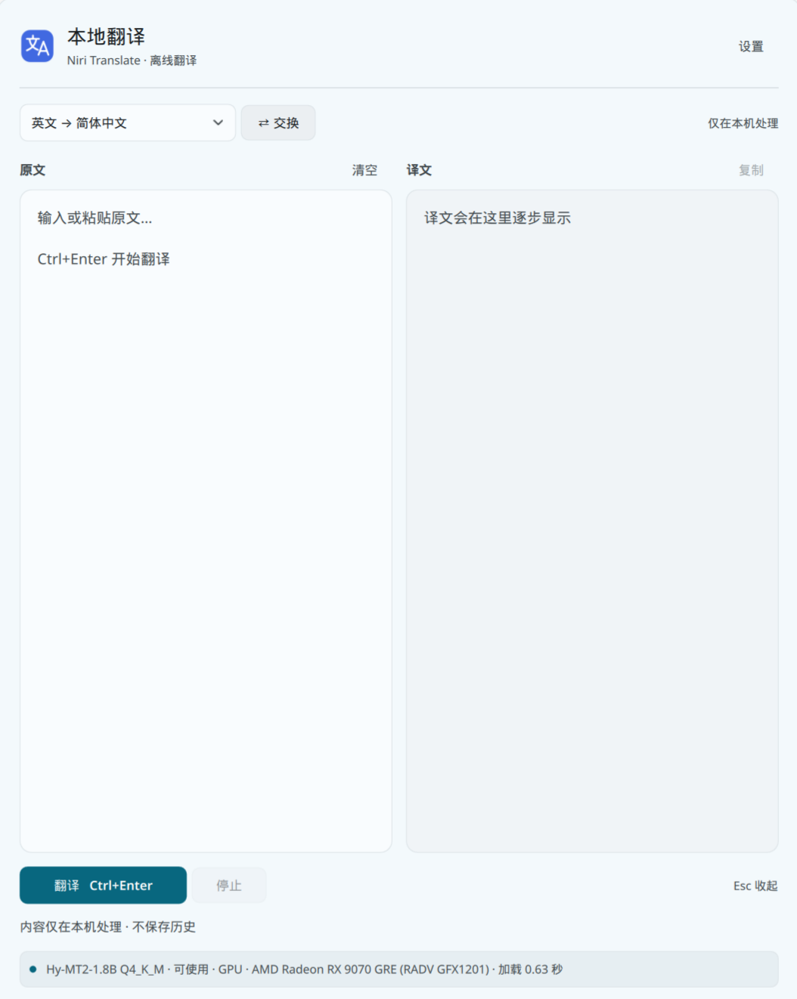

# Niri Translate

适用于 Linux / niri / Wayland 的本地中英文翻译客户端。点击系统托盘图标，从屏幕右侧滑出翻译抽屉；使用轻量翻译专用模型，自动检测可用 GPU（Vulkan），不可用或加载失败时回退 CPU。模型下载完成后可离线翻译，原文和译文均留在本机。

<p align="center">
  
</p>

## 功能

- 原文、译文左右双栏；`Ctrl+Enter` 翻译，流式输出，可停止、复制。
- 点击抽屉外部或 `Esc` 收起，内存中保留文字；退出后不保存历史。
- 独立的 Wayland layer-shell 面板，不占用 niri 平铺布局；设置在抽屉内。
- 跟随 **Clavis 的 Material 配色和浅色/深色主题**，文件更新后自动同步，无需重启。
- 紧凑模型卡片显示名称、大小和下载状态；点击“详情”查看来源、完整路径，打开目录或复制路径。
- 模型库支持“常用小模型”“全部模型”“已在本地”筛选、搜索和在线更新。
- 默认存储位置跟随当前用户的 XDG 目录；也可选择自定义文件夹，一键恢复系统默认。
- 固定版本 GGUF 按需下载、进度、取消、断点续传、SHA-256 校验；外部模型关联在切换后保留。
- 设置中选择自动 GPU / 仅 CPU，显示检测到的显卡、显存和当前运行设备。
- 单实例、同一时间只运行一个模型；切换先卸载，退出清理推理进程。
- 登录自启默认关闭；开启后仅显示托盘。


## 环境与版本

开发环境：Fedora 44、niri 26.04、Clavis/Quickshell 顶部栏，Intel i5-13400、约 32 GB 内存、AMD RX 9070 GRE。支持仅 CPU 运行，无需独立显卡；其他发行版需自行安装对应依赖。

| 组件 | 锁定 / 验证版本 |
| --- | --- |
| Python | >= 3.11；安装环境实测 3.13.5 |
| PySide6 / Qt Python 组件 | 6.11.2，依赖与哈希见 `requirements.lock` |
| Quickshell | 0.3.1（本机 RPM `0.3.1-2.fc44`），使用系统 Qt |
| llama.cpp | v0.5.0，提交 `d2e54583c7452353eb35d40431281f6ee984332f` |
| 推理配置 | 自动 GPU / CPU，CPU 最多 8 线程，8192 上下文，单 slot |

界面使用 Quickshell/QML；Python/PySide6 负责托盘、设置、下载及进程管理，通过当前用户私有 Unix socket 与抽屉通信。两个 Qt 版本分属独立进程，不混载动态库。独立于 Clavis 源码，Clavis 只作为配色来源；没有 Clavis 时使用明暗主题后备色。

## 安装和启动

需要已有 Wayland 会话和支持 StatusNotifierItem 的托盘（Clavis 已支持）。先安装发行版提供的 `quickshell`（验证版本 0.3.1）及构建依赖：

```bash
sudo dnf install python3 uv gcc-c++ cmake ninja-build curl git
# 可选：Vulkan GPU 构建依赖（还需要适配显卡的 Vulkan 驱动）
sudo dnf install vulkan-loader-devel glslc spirv-headers-devel
# quickshell 按其官方 Fedora 安装说明配置软件源后安装。
git clone https://github.com/chalmery/niri-translate.git
cd niri-translate
./scripts/install.sh
```

安装脚本创建专用虚拟环境、校验并编译固定提交的运行时（构建依赖齐全时启用 Vulkan，否则 CPU），安装图标与 `.desktop` 入口。不会自动下载模型、开启自启或修改 niri/Clavis 配置。

从应用菜单搜索 **Niri 本地翻译 / Niri Translate**，或执行：

```bash
~/.local/bin/niri-translate
# 仅托盘启动：
~/.local/bin/niri-translate --background
```

首次进入抽屉的“设置”，在模型卡片中下载默认模型或导入模型库中的已有 GGUF。已在本地、未下载、下载未完成和大小异常会分别显示；“已在本地”表示文件存在且大小匹配，加载前仍执行完整 SHA-256 校验。模型校验和加载期间仍能编辑文本。之后可完全离线翻译。点击托盘图标切换抽屉，右键菜单提供打开、设置、退出。

如要配置 niri 快捷键，可自行在已有 `binds` 中加入：

```kdl
Mod+T { spawn "niri-translate"; }
```

不需要浮动窗口规则。抽屉宽度可在设置或通过拖动左边缘调整并记住；高度适应屏幕可用空间。托盘不可用时保留可见抽屉，设置页面底部仍可退出。

## GPU 加速

运行时通过 `llama-server --list-devices` 检测实际可用的推理设备，过滤软件渲染器，自动优先选择空闲显存最多的 GPU。GPU 模式将所有模型层放到该设备；加载失败或超时会自动重试 CPU 一次。仅 CPU 模式使用 `--device none`，完全禁用 GPU 卸载。GPU 是否更快取决于硬件和输入，设置中可切换对比。

已有 CPU 安装可在安装上述 Vulkan 构建依赖后执行：

```bash
./scripts/build-runtime.sh
# 可显式选择构建后端：
NIRI_TRANSLATE_BACKEND=vulkan ./scripts/build-runtime.sh
NIRI_TRANSLATE_BACKEND=cpu ./scripts/build-runtime.sh
```

构建使用动态后端；无兼容 GPU 时仍可使用 CPU。构建完成后重启客户端以重新检测设备。默认模式为自动；设置中的模式选择会保存，切换模式会停止当前翻译并重新加载模型。该版不修改显卡驱动。NVIDIA 显卡也可走 Vulkan，但须安装支持 Vulkan 的 NVIDIA 驱动并被运行时识别；当前构建未启用 CUDA，未进行 NVIDIA 硬件实测。

## 模型库与下载来源

模型权重从 **Hugging Face** 下载。目录通过公开的 `GET https://huggingface.co/api/models/{repo}?blobs=true` 接口读取文件列表、固定提交、大小和 LFS SHA-256；随后使用 `https://huggingface.co/{repo}/resolve/{revision}/{filename}` 下载指定版本。

`model_sources.json` 定义常用系列及来源，`models.json` 提供可离线浏览的固定快照。设置中的“在线更新”只获取目录，不下载权重；更新后的目录保存在数据目录的 `model-catalog.json`。更新失败保留已有列表，部分仓库失败也不会影响本地模型。仓库出现新权重时保留旧版本条目，避免替换已下载或正在使用的文件。

模型按翻译用途、本地可用性和资源占用筛选，不按品牌限定。默认“常用小模型”推荐 Hy-MT2-1.8B 和 TranslateGemma 4B 的 Q4_K_M，并显示本地/当前选项；“全部模型”包含其他量化和较大的 Hy-MT2-7B。当前内置 3 个型号、10 个可下载版本，也可只看已在本地或搜索名称。

| 模型 | 常用版本 / 下载大小 | 用途 | GGUF 来源 |
| --- | --- | --- | --- |
| Hy-MT2-1.8B | Q4_K_M / 1.13 GB | 日常翻译，默认推荐 | tencent 官方 |
| TranslateGemma 4B | Q4_K_M / 2.49 GB | Google 翻译专用小模型 | bullerwins 社区量化 |
| Hy-MT2-7B | Q4_K_M / 4.62 GB | 可选较大模型，占用更多内存 | tencent 官方 |

大小按十进制 GB 四舍五入，不等于运行内存。Q4、Q6、Q8 等表示不同精度的压缩版本（量化），用于权衡文件大小、内存占用和翻译效果。初次使用可选择推荐的 Q4_K_M。点击卡片“详情”可查看发布者、仓库与本地路径，“模型来源”打开下载仓库。

TranslateGemma 的适配代码和目录元数据已接入，尚未完成本机推理与翻译质量验收。已有 Hy-MT2-1.8B Q4_K_M 的验证范围见[历史验收记录](docs/validation.md)。

目前接入常用的 Q4_K_M、Q5_K_M、Q6_K、Q8_0 单文件 GGUF，跳过分片权重和视觉投影文件。Hy-MT 使用 GGUF 内嵌模板和原采样参数；TranslateGemma 使用 Gemma 聊天包装及专用中英文翻译提示词，贪心解码，并按模型卡将每段输入控制在 2048 tokens 内。后者的结构化语言字段不能直接经当前 llama.cpp 聊天接口透传，因此客户端先渲染翻译指令，运行时覆盖聊天包装，避免启动探测和请求模板报错。

参考：[Google 模型卡](https://huggingface.co/google/translategemma-4b-it)、[Ollama 的 TranslateGemma 文本提示格式](https://ollama.com/library/translategemma)、[GGUF 发布仓库](https://huggingface.co/bullerwins/translategemma-4b-it-GGUF)。Qwen-MT 的[官方接入文档](https://www.alibabacloud.com/help/en/model-studio/machine-translation)提供云 API；当前客户端未接入云端翻译服务。NLLB、Marian 等需要其他推理引擎，暂未接入。

此前缓存中的通用模型条目会被自动过滤，若原选择已移出模型库则使用默认翻译模型；已下载的文件不会自动删除。

原先三个模型的 ID 和文件位置保持兼容，新增条目按 `模型目录/catalog/SHA-256/文件名` 隔离存储，避免不同仓库或版本的同名文件相互覆盖。加载前仍校验完整 SHA-256；下载失败保留 `.gguf.part` 以便续传。导入本地文件时按当前模型目录中的大小及完整哈希识别，不仅依赖文件名。

### 自定义模型存储目录

在设置中的“模型存储位置”选择文件夹或填写绝对路径（支持 `~/Models`），点击“应用目录”保存。目录不存在时会尝试创建，并检查写入权限；失败时保留原配置。更改目录会停止当前翻译，重新扫描并加载所选模型；下载、校验、加载过程中暂时不能更改目录。

新下载及 `.gguf.part` 断点文件使用保存后的目录。已有模型和未完成的下载不会自动搬移：可以导入旧目录中的模型，或切回旧目录续传。导入的外部文件始终在原路径使用。“恢复默认”直接清除自定义目录设置并重新加载，后续启动按当前用户的系统数据目录解析；配置中不保存默认目录的绝对路径。旧版保存的路径若与当前默认目录一致，会自动归回默认模式。

## 翻译与隐私

服务只监听 `127.0.0.1` 随机端口，使用临时 API key，关闭 Web UI，并开启 `--offline`。客户端只在点击在线更新、下载或模型来源时访问 Hugging Face；目录刷新不上传原文或译文，正常翻译不访问外部接口。安装依赖、构建运行时需要联网。

按模型使用内嵌模板或专用翻译模板，原文只进入翻译提示词，不具备执行命令或调用工具的权限。模型仍可能受原文中的指令影响译文质量，不能把提示词视为可靠的语义隔离。

按 `/props` 的实际上下文及 `/tokenize` 的真实 token 数预算。先保留换行/段落和完整代码围栏，再对超长段落按句子拆分；单个句子仍太长时按测量后的字符/词边界继续拆分，不丢字、不静默截断。分段可能损失跨段语境。单次本地通信帧上限为 8 MiB，超过时明确报错并阻止使用旧原文翻译，需要分批粘贴。检测输出长度限制或意外流结束，保留部分结果并明确标记未完成。

取消、重新翻译和切换模型有请求代次隔离，旧结果不能覆盖新结果。默认不保存原文、译文或历史；日志只保留启动、退出和 QML 诊断。不要在诊断时开启含请求内容的 llama.cpp 调试日志。

## 主题与桌面集成

默认只读 Clavis：

- 配置：`$XDG_CONFIG_HOME/clavis/config.json`
- 配色：`$XDG_DATA_HOME/clavis/profiles/default/generated/clavis/colors.json`

支持 Clavis 的 `CLAVIS_CONFIG_HOME`、`CLAVIS_DATA_HOME`、`CLAVIS_PROFILE`、`CLAVIS_PROFILE_HOME`、`CLAVIS_GENERATED_HOME`、`CLAVIS_PERSONALIZATION_CONFIG` 环境覆盖。文件及目录同时监听，兼容 matugen 原子替换文件；监听遗漏时 3 秒轮询补偿。抽屉背景复用 Clavis `colLayer0Base` 的混色规则，文字/强调色使用对应 Material 语义色，并跟随背景透明度。当前不复制 Clavis 的专有模糊效果。

登录自启使用标准 XDG autostart；桌面会话需要支持这一机制（例如 niri-session 的 `xdg-desktop-autostart.target`）。设置开关只管理本应用的 `.desktop` 文件。

固定标识：托盘/桌面应用 `io.github.chalmery.niri-translate`；Wayland layer-shell namespace `niri-translate-drawer`。层面板没有普通 xdg-toplevel 窗口的 app_id。

## 目录与卸载

所有默认目录在安装或启动时按当前用户解析，不包含开发者用户名或源码目录。优先使用 XDG 环境变量；未设置时使用当前用户的主目录（下表中的 `~`）。桌面入口由安装脚本在目标机器上生成。

| 内容 | 目录 |
| --- | --- |
| 配置 | `$XDG_CONFIG_HOME/niri-translate/`，缺省 `~/.config/niri-translate/` |
| 模型 | `$XDG_DATA_HOME/niri-translate/models/`，缺省 `~/.local/share/niri-translate/models/`；可自定义 |
| Python 环境/运行时 | `$XDG_DATA_HOME/niri-translate/{venv,runtime}/`，缺省基目录 `~/.local/share/` |
| 日志 | `$XDG_STATE_HOME/niri-translate/`，缺省 `~/.local/state/niri-translate/` |
| 单实例锁/通信 | `$XDG_RUNTIME_DIR/niri-translate/` |
| 登录自启 | `$XDG_CONFIG_HOME/autostart/io.github.chalmery.niri-translate.desktop`，缺省基目录 `~/.config/` |

先从托盘退出，再执行：

```bash
./scripts/uninstall.sh                         # 保留模型、配置和日志
./scripts/uninstall.sh --purge                 # 另删配置和日志
./scripts/uninstall.sh --purge --delete-models # 明确选择删除默认目录内的模型
```

自定义存储目录和外部选择的本地 GGUF 从不删除，需要自行管理。卸载不删除源码仓库；构建缓存 `.build/` 可自行清理。当前版本不需要任何浮动窗口配置。

## 开发与验证

```bash
PYTHON_BIN="${XDG_DATA_HOME:-$HOME/.local/share}/niri-translate/venv/bin/python"
"$PYTHON_BIN" -m unittest discover -s tests -v
# 真实桌面验收会使用测试文本并退出测试实例；先退出正在使用的客户端：
"$PYTHON_BIN" tests/live_acceptance.py
# 实际运行时与长输入检查：
"$PYTHON_BIN" tests/runtime_acceptance.py /tmp/runtime-test.json
# 使用隔离配色验证浅色→深色→浅色，不改系统主题；需要 matugen：
"$PYTHON_BIN" tests/theme_live.py
```

源代码：`app.py` 管理托盘/状态/通信，`ui/shell.qml` 绘制抽屉，`theme.py` 跟随主题，`runtime.py` 管理子进程，`inference.py` 负责真实 token 预算和流式翻译，`download.py` 负责可恢复下载，`storage.py` 管理 XDG 与完整性校验。

扩展模型系列仅限翻译专用模型，需在 `model_sources.json` 中登记可信 GGUF 仓库、翻译用途、模板配置与默认量化，再更新目录快照并做真实推理及质量验收；仅添加目录项不等于已经验证兼容。

[验收记录](docs/validation.md)记录的是当时版本的实测结果，不代表后续模型库、路径设置与界面改动已通过回归测试。本轮未运行测试，需在目标环境验收。当前不包含 OCR、划词、云 API、账户或历史记录。
