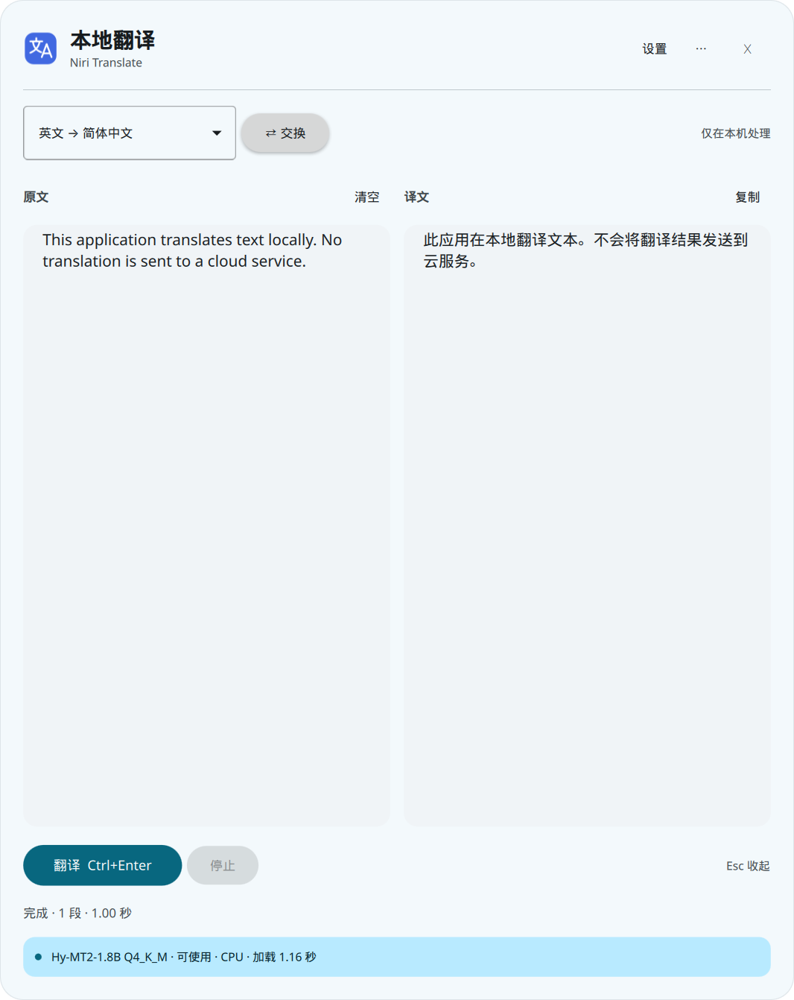
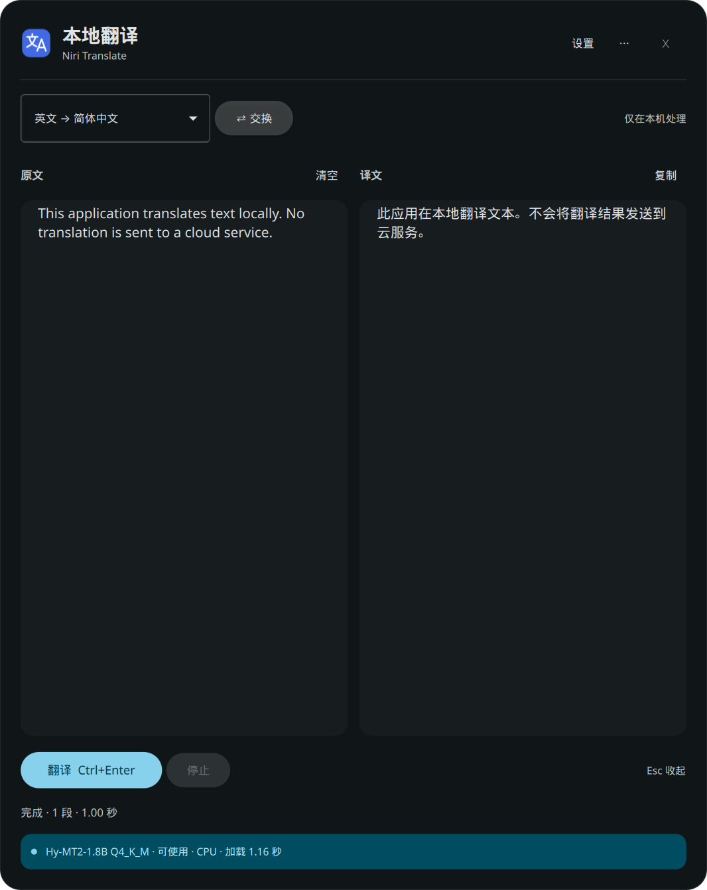

# 实际验证记录

日期：2026-09-27。Fedora 44 / niri 26.04 / Clavis + Quickshell 0.3.1，Intel i5-13400，16 逻辑 CPU，约 30 GiB 可见内存。模型和运行时均为真实本地进程，未使用模拟译文。

## 推理与质量

先验证默认模型，再编写桌面界面。模型：Hy-MT2-1.8B Q4_K_M，官方 revision `a0c709d9fac510f2c807aa3af52872340dc37a4a`；SHA-256 见模型目录文件。运行时为 `runtime.lock.json` 固定提交，CPU 8 线程、8192 上下文、单 slot。

- 首次 llama-server 启动至健康检查通过：**1.006 秒**。这是本次首次进程加载，模型文件可能已在操作系统页缓存中，不能当作机器冷启动成绩；不包含应用事先的 SHA-256 校验。
- 五组测试完成后服务进程 RSS / 峰值 RSS：**2,451,132 KiB（约 2.34 GiB）**。这是实际驻留内存，不是模型文件大小。
- 默认模型下载文件：1,133,080,448 字节，完整 SHA-256 已核对。

| 测试 | 原文字符数 | 首字延迟 | 完整耗时 |
| --- | ---: | ---: | ---: |
| 日常英文短句→中文 | 48 | 0.412 s | 0.686 s |
| 日常中文短句→英文 | 17 | 0.341 s | 0.916 s |
| 中文邮件→英文 | 65 | 0.306 s | 2.909 s |
| 英文技术说明→中文 | 189 | 0.514 s | 2.288 s |
| 列表、URL、占位符、代码段→中文 | 162 | 0.310 s | 2.575 s |

首字和完整耗时从翻译调用开始计时，包含模板处理及 token 预算，模型已加载。各用例只测一次，不是统计基准；输出采样会导致结果变化。原文、完整真实译文及测量值保存在 `benchmark.json`。

观察到的问题：

- “Please close the window before leaving the room.” 输出“离开房间前请关闭窗口。”实体窗户被译成了“窗口”，存在词义选择问题。
- 邮件内容基本保留，英文 “The attachment is the project progress report…” 较生硬，可以更自然。
- 技术文本保留 `127.0.0.1`、`HTTP 503`，未发现本组中的实质漏译。
- 格式样例保留列表、URL、`${TOKEN}`、`timeout_ms = 3000` 和围栏代码块。代码围栏由客户端原样保留，不能将它计为模型的翻译能力。
- 后续抽屉样例中 “No translation is sent…” 也出现了简化为“不会将其发送…”的表达。小模型可能概括或换义，需要人工复核重要内容。

## 桌面和功能

`desktop-test.json` 为实际 Wayland 会话中执行 `tests/live_acceptance.py` 的结果：

- 通过已安装 `.desktop` 文件（`gio launch`）启动成功。
- 标准 StatusNotifierItem 注册到正在运行的 Clavis 托盘；调用该托盘项的真实 `Activate` 方法能唤起抽屉。
- 抽屉确实作为 layer-shell surface 显示；niri 普通窗口列表中没有本应用窗口。
- 隐藏后 surface 消失，重新打开保留原文、译文。
- 再次启动后，主进程 PID 和子进程集合不变。
- 真实中英双向翻译、停止保留部分结果、新旧请求隔离通过。
- 切换到未下载模型会卸载旧进程，不隐式下载。重新选择默认模型可恢复。
- 强制结束本应用的推理子进程后，原文仍保留，重新加载成功。
- 抽屉宽度设置生效。
- 自启开关生成带 `--background` 的 XDG autostart 文件，当前桌面会话的 systemd generator 实际识别为 autostart unit。关闭后文件移除；测试后恢复为默认关闭。
- 退出后本应用启动的 Quickshell 和推理子进程均被清理。

托盘注册和 Activate 调用是协议层的实际桌面验证，**不等价于人工点击图标的视觉验收**。新抽屉的实体键盘 `Ctrl+Enter` / `Esc`、鼠标点击外部、拖动边缘、右键复制以及中文输入法组合输入仍需人工确认；旧 QWidget 原型的快捷键测试不计入当前抽屉验收。

## 明暗主题与视觉

实际只读 Clavis 的配色/配置：当前系统浅色背景混色 `#f3f9fc`，正文 `#171c1f`。界面源码不依赖或修改 Clavis 源码。

`tests/theme_live.py` 使用同一源色 `#2b5969` 由 matugen `--dry-run` 生成独立测试配色，运行真实抽屉，验证浅色→深色→浅色的动态更新，保持模型和文本不变。**没有改变用户系统的当前主题**。深色背景 `#101618`，正文 `#dee3e6`。

截图均来自真实 Quickshell surface 的 `grabToImage`，不是设计稿：

| 浅色 | 深色 |
| --- | --- |
|  |  |

`theme-test.json` 记录实际 UI 状态；文件原子替换及颜色配对另有自动测试。系统的实际主题切换按钮触发路径未进行人工点击验收，但其写入的主题文件格式和同一文件监听机制已验证。

## 离线、长输入、下载

`runtime-test.json`：在 `unshare -Urn` 创建的独立网络命名空间中只开启 `lo`，使用真实接口枚举确认仅有回环接口。模型成功输出：

> After the model is downloaded, local translation can be performed even without an internet connection.

没有断开或修改用户桌面的网络连接。

实际 tokenizer 检查了 **29,600 字符 / 17,649 prompt tokens** 的输入：分为 5 段，每段最大 4,062 tokens（预算 4,064），拼接回原文逐字相等。本测试验证真实分段预算与完整性，未对整段 29,600 字符生成完整译文或进行质量验收。另用真实模型将 `n_predict` 限制为 1，验证服务返回 `stop_type=limit`；客户端对应的“未完成”处理有单元测试。

`download-test.json`：针对官方固定 revision 的真实下载地址，用默认模型的测试副本保留已有前缀，取消尾部下载后保留 `.part`，随后实际续传并通过完整 SHA-256。测试副本结束后移除，不影响用户的正式模型文件。服务端忽略 Range、无效范围、短下载、坏哈希重试等异常路径使用确定性测试覆盖。

## 质量检查与边界

- 16 项自动测试通过：下载恢复/校验、分段完整性、流异常、空输入不请求、主题语义配色和原子替换监听。
- Python 编译检查、Shell 语法、desktop 文件校验、Git diff 检查分别执行；这些不作为桌面验证证据。
- `qmllint` 剩余一项 `PanelWindow is not creatable`：系统 Quickshell 的动态 QML 类型注册与普通 qmllint 的静态视图不同；真实 Quickshell 已成功创建该面板。没有将 qmllint 报为全绿。
- 安装的 llama-server 及其库使用 `$ORIGIN` 相对 RUNPATH，已验证从安装目录加载依赖，不依赖源码构建目录仍然存在。

尚未完成、不能宣称通过的项目：

1. 真正注销并重新登录的端到端自启；目前验证到标准启动项、会话 generator 和后台启动行为。
2. 上述实体鼠标/键盘/输入法操作的人工验收，以及下载和加载过程中长时间手动操作界面的压力测试。
3. Q8_0、7B Q4_K_M 的完整下载、实际加载、翻译质量与内存基准；当前核对了官方文件、哈希和模型系列兼容路径。
4. 无托盘会话、多屏热插拔及长期稳定性。当前抽屉选择 Quickshell 枚举的第一个屏幕，未实现跟随鼠标跨屏定位。
5. 实际 Clavis 模糊效果；本版同步配色及背景透明度，不复制专有模糊组件。

系统集成过程中仅临时给旧原型添加过一条 niri 浮动规则，修改前生成备份；切换抽屉方案后已删除该规则。没有改动顶部栏或 Clavis 源码。
